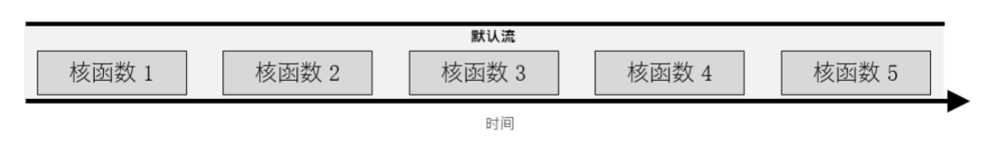

# 异步流及使用 CUDA C/C++ 对加速应用程序开展可视化分析

CUDA 工具包附带 **NVIDIA Visual Profiler**（或 **nvvp**），这是一款用于支持开发 CUDA 加速应用程序的强大 GUI 应用程序。nvvp 会生成加速应用程序的图解时间轴，其中包含有关 CUDA API 调用、核函数执行、内存活动和 **CUDA 流**使用情况的详细信息。

此外，nvvp 还提供一套分析工具，开发人员可通过运行这些工具接收有关如何有效优化其加速应用程序的明智建议。CUDA 开发人员必须认真学习 nvvp。

在本实验中，您将按照 nvvp 时间轴的指引以优化加速应用程序。此外，您还将学习一些中级 CUDA 编程技术来协助完成相关工作：**非托管内存分配和迁移**；**钉固**或**页锁定**主机内存；以及**非默认并发 CUDA 流**。

本实验学习课程结束时，我们将为您提供一份评估测试，让您加速和优化一款简单的 n-body 模拟器，这可让您借此展示在本课程学习期间所掌握的技能。若测试者能够在保持正确性的同时加速模拟器，我们将为其颁发证书以资证明。

## Prerequisites

如要充分利用本实验，您应已能胜任如下任务：

- 编写、编译及运行既可调用 CPU 函数也可启动 GPU 核函数的 C/C++ 程序。
- 使用执行配置控制并行线程层次结构。
- 重构串行循环以在 GPU 上并行执行其迭代。
- 分配和释放 CUDA 统一内存。
- 理解统一内存在分页错误和数据迁移方面的行为。
- 使用异步内存预取减少分页错误和数据迁移。


## Objectives

当您在本实验完成学习后，您将能够：

- 使用 **NVIDIA Visual Profiler** (**nvvp**) 对 GPU 加速 CUDA 应用程序的时间轴进行可视化分析。
- 借助 nvvp 识别并利用 GPU 加速 CUDA 应用程序中存在的优化机会。
- 利用 CUDA 流在加速应用程序中并发执行核函数。
-（**可选高阶内容**）使用手动内存分配（包括分配钉固内存），以便在并发 CUDA 流中异步传输数据。


### Exercise: Examine Timeline of Compiled CUDA Code

`vector-add-no-prefetch.cu`包含一个可运行的加速向量加法应用程序。请使用下方的代码执行单元进行编译和运行。您应能看到一则打印消息，表明已编译成功。

```sh
nvcc -arch sm_70 -o vector-add-no-prefetch vector-add-no-prefetch.cu -run
```

成功编译应用程序后，请使用 `nvvp`打开已编译的可执行文件并最大化其时间轴窗口，然后执行以下操作：

- 创建将显示 `addVectorsInto` 核函数执行时间的时间轴标尺。
- 确定应用程序时间轴中的何处发生 CPU 分页错误。确定 [应用程序源代码]`vector-add.cu`中引起这些 CPU 分页错误的位置。
- 在时间轴中找到*数据迁移 (DtoH)*（设备到主机）事件。这些事件的发生时间几乎与核函数执行后发生 CPU 分页错误的时间相同。这些事件为何会在此时发生，而非在核函数执行前发生 CPU 分页错误期间？
- GPU 分页错误、HtoD 数据迁移事件与 `addVectorsInto` 核函数执行之间在时间轴上有何关系？查看源代码后，您能否明确解释以上事件为何会以这种方式发生？

### Exercise: Add Asynchronous Prefetching

[`01-vector-add-prefetch-solution.cu`](../../../../../edit/tasks/task1/task/03_AC_STREAMS_NVVP-zh/01-vector-add/solutions/01-vector-add-prefetch-solution.cu) 可重构上述向量加法应用程序，以便在启动核函数之前将其 `addVectorsInto` 核函数所需的 3 个向量异步预取到处于活动状态的 GPU 设备（通过使用 [`cudaMemPrefetchAsync`](http://docs.nvidia.com/cuda/cuda-runtime-api/group__CUDART__MEMORY.html#group__CUDART__MEMORY_1ge8dc9199943d421bc8bc7f473df12e42)）。打开源代码并确定在应用程序中的何处作出这些更改。

查看更改后，请使用下方的代码执行单元编译和运行重构后的应用程序。您应能看到打印出的成功消息。

### Exercise: Compare the Timelines of Prefetching vs. Non-Prefetching

[`01-vector-add-prefetch-solution.cu`](../../../../../edit/tasks/task1/task/03_AC_STREAMS_NVVP-zh/01-vector-add/solutions/01-vector-add-prefetch-solution.cu) 可重构上述向量加法应用程序，以便在启动核函数之前将其 `addVectorsInto` 核函数所需的 3 个向量异步预取到处于活动状态的 GPU 设备（通过使用 [`cudaMemPrefetchAsync`](http://docs.nvidia.com/cuda/cuda-runtime-api/group__CUDART__MEMORY.html#group__CUDART__MEMORY_1ge8dc9199943d421bc8bc7f473df12e42)）。打开源代码并确定在应用程序中的何处作出这些更改。

查看更改后，请使用下方的代码执行单元编译和运行重构后的应用程序。您应能看到打印出的成功消息。


```sh
nvcc -arch sm_70 vector-add-prefetch/01-vector-add-prefetch-solution.cu -run
```

使用 [nvvp](/novnc) 打开经编译的可执行文件，并在执行预取之前使先前的会话和向量加法应用程序保持开启状态。最大化时间轴窗口，然后执行以下操作：

- 创建将显示 `addVectorsInto` 核函数执行时间的时间轴标尺。在添加异步预取之前，如何将执行时间与 `addVectorsInto` 核函数的执行时间进行比较？
- 在时间轴的*运行时 API* 部分中找到 `cudaMemPrefetchAsync`。
- 请在重构前参考应用程序的时间轴，您将可在时间轴的*统一内存*部分中看到：由于对统一内存的需求增加，核函数执行期间已发生多组 *GPU 分页错误*。在执行预取之后，这些分页错误是否依然存在？
- 即使 GPU 分页错误消失，我们仍需将数据从主机迁移到设备。使用时间轴的*数据迁移 (HtoD)* 部分比较这两个应用程序之间的这些迁移。比较它们的数量、执行所需的时间及其相对 `addVectorsInto` 核函数执行的发生时间。
- 查看这 2 个应用程序的整体运行时，该如何对它们进行比较？


### Exercise: Profile Refactor with Launch Init in Kernel

在向量加法应用程序的上一次迭代中，向量数据正在 CPU 上进行初始化，因此在 `addVectorsInto` 核函数可以对该数据执行操作之前需要将其迁移到 GPU。

在应用程序 [01-init-kernel-solution.cu](../../../../../edit/tasks/task1/task/03_AC_STREAMS_NVVP-zh/02-init-kernel/solutions/01-init-kernel-solution.cu) 的下一次迭代中，我们已将应用程序重构为在 GPU 上并行初始化数据。

由于初始化目前在 GPU 上进行，因此预取操作已在初始化之前完成，而非在执行向量加法操作之前。查看源代码以确定作出这些更改的位置。

查看更改后，请使用下方的代码执行单元编译和运行重构后的应用程序。您应能看到打印出的成功消息。


```sh
nvcc -arch=sm_70 -o init-kernel 02-init-kernel/solutions/01-init-kernel-solution.cu -run
```

在 nvvp 的另一个会话中打开经编译的可执行文件，然后执行以下操作：

- 创建时间轴标尺以衡量应用程序的整体运行时、`addVectorsInto` 核函数的运行时以及初始化核函数的运行时。将应用程序和 `addVectorsInto` 的运行时与应用程序的先前版本进行比较，看看有何变化？
- 查看时间轴的*计算*部分。在 `addVectorsInto` 和初始化核函数这两个核函数中，哪一个在 GPU 上占用了大部分时间？
- 您的应用程序包含以下哪几项？
- CPU 分页错误
- GPU 分页错误
- 数据迁移 (HtoD)
- 数据迁移 (DtoH)


### Exercise: Profile Refactor with Asynchronous Prefetch Back to the Host

目前，向量加法应用程序可以在主机上验证向量加法核函数的结果。在应用程序 [01-prefetch-check-solution.cu](../../../../../edit/tasks/task1/task/03_AC_STREAMS_NVVP-zh/04-prefetch-check/solutions/01-prefetch-check-solution.cu) 的下一次重构中，我们会将数据异步预取回主机以进行验证。

查看更改后，请使用下方的代码执行单元编译和运行重构后的应用程序。您应能看到打印出的成功消息。


```sh
nvcc -arch=sm_70 prefetch-check/prefetch-check-solution.cu -run
```

在 nvvp 中打开新编译的可执行文件，最大化时间轴并执行以下操作：

- 关于添加预取回 CPU 之前和之后的*数据迁移 (DtoH)* 事件，请使用时间轴的*统一内存*部分比较其异同点。
  - 如何比较 CPU 分页错误的数量？
  - 如何比较 DtoH 迁移所需的总时间？
- 请查看时间轴的*流*部分以继续学习下一节。请注意，所有核函数均在*默认*流中执行，并且核函数是在默认流中顺次执行。我们将在下一节伊始介绍流的内容。


## Concurrent CUDA Streams

默认情况下，CUDA核函数会在默认流中运行。

在任何流中，其所含指令(包括核函数)必须在下一个流开始前完成。我们还可以创建非默认流，以便核函数执行。

任一流中的核函数均按顺序执行。


在 CUDA 编程中，**流**是按顺序执行的一系列命令。在 CUDA 应用程序中，核函数执行和一些内存传输均在 CUDA 流中进行。直至此时，您仍未正式使用 CUDA 流；但正如上次练习中 nvvp 时间轴所示，您的 CUDA 代码已在名为*默认流*的流中执行其核函数。

除默认流以外，CUDA 程序员还可创建并使用非默认 CUDA 流，此举可支持执行多个操作，例如在不同的流中并发执行多个核函数。多流的使用可以为您的加速应用程序带来另外一个层次的并行，并能提供更多应用程序优化机会。


### Rules Governing the Behavior of CUDA Streams

为有效利用 CUDA 流，您应了解有关 CUDA 流行为的以下几项规则：

- 给定流中的操作会按序执行。
- 就不同非默认流中的操作而言，无法保证其会按彼此之间的任何特定顺序执行。
- 默认流会受到阻碍，并在其他所有流完成之后方可运行，但其亦会阻碍其他流的运行直至其自身已运行完毕。


### Creating, Utilizing, and Destroying Non-Default CUDA Streams

以下代码演示了如何创建、利用和销毁非默认 CUDA 流。

请注意：如要在非默认 CUDA 流中启动 CUDA 核函数，必须将流作为执行配置的第 4 个可选参数进行传递。目前为止，您只使用了执行配置的前 2 个参数：

```cpp
cudaStream_t stream;       // CUDA streams are of type `cudaStream_t`.
cudaStreamCreate(&stream); // Note that a pointer must be passed to `cudaCreateStream`.

someKernel<<<number_of_blocks, threads_per_block, 0, stream>>>(); // `stream` is passed as 4th EC argument.

cudaStreamDestroy(stream); // Note that a value, not a pointer, is passed to `cudaDestroyStream`.
```

执行配置的第 3 个可选参数虽已超出本实验的学习范围，但仍值得一提。此参数允许程序员提供**共享内存**的字节数，以便在此核函数启动时按块进行动态分配。按块分配给共享内存的默认字节数为 `0`，在本实验的余下练习中，您会将 `0` 作为此值进行传递以揭示极为重要的第 4 个参数：

### Exercise: Predict Default Stream Behavior

`print-number/01-print-numbers.cu` 应用程序带有一个非常简单的 `printNumber` 核函数，可用于接受及打印整数。仅在单个线程块内使用单线程执行该核函数，但使用“for 循环”可执行 5 次，并且每次启动时都会传递“for 循环”的迭代次数。

使用下方的代码执行线程块编译和运行 [01-print-numbers](../../../../../edit/tasks/task1/task/03_AC_STREAMS_NVVP-zh/05-stream-intro/01-print-numbers.cu) 应用程序。您应能看到打印的数字 `0` 至 `4`。


```shell
nvcc -arch=sm_70 -o print-numbers 05-stream-intro/01-print-numbers.cu -run
```

既已了解核函数在默认情况下会在默认流中执行，那么据您预计，`print-numbers` 程序的 5 次启动将会顺次执行还是会并行执行？您应能提及默认流的两个功能来支持您的回答。在 nvvp 的新会话中打开可执行文件并最大化时间轴，然后在核函数启动时进行放大以确认答案。

### Exercise: Implement Concurrent CUDA Streams

由于核函数的所有 5 次启动均在同一个流中发生，因此看到 5 个核函数顺次执行也就不足为奇。此外，也可以这么说，由于默认流受到阻碍，所以核函数的每次启动都会在完成之后才启动下一次，而事实也是如此。

重构 [01-print-numbers](../../../../../edit/tasks/task1/task/03_AC_STREAMS_NVVP-zh/05-stream-intro/01-print-numbers.cu) 应用程序，以便核函数的每次启动都在自身非默认流中进行。若已不再需要所创建的流，请务必予以销毁。请使用下方的代码执行单元编译和运行经重构的代码。您应仍能看到打印的数字 `0` 至 `4`，不过这些数字不一定会按升序排列。如您遇到问题，请参阅 [解决方案](../../../../../edit/tasks/task1/task/03_AC_STREAMS_NVVP-zh/05-stream-intro/solutions/01-print-numbers-solution.cu)。


```python
!nvcc -arch=sm_70 -o print-numbers-in-streams 05-stream-intro/01-print-numbers.cu -run
```

您既已为核函数的 5 次启动使用 5 个不同的非默认流，您预计它们会顺次执行还是会并行执行？除目前对流的了解之外，您还需考虑 `printNumber` 核函数的简单程度，也就是说，即使您预测并行运行，核函数的完成速度是否仍会允许完全重叠？

做出假设后，请使用重构程序的可执行文件打开新的 nvvp 会话并最大化时间轴，然后放大核函数执行以查看其实际行为。

### Exercise: Use Streams for Concurrent Data Initialization Kernels

您一直使用的向量加法应用程序 [01-prefetch-check-solution.cu](../../../../../edit/tasks/task1/task/03_AC_STREAMS_NVVP-zh/04-prefetch-check/solutions/01-prefetch-check-solution.cu) 目前启动 3 次初始化核函数，即：为 `vectorAdd` 核函数需要初始化的 3 个向量分别启动一次。重构该应用程序，以便在其各自的非默认流中启动全部 3 个初始化核函数。在使用下方的代码执行单元编译及运行时，您应仍能看到打印的成功消息。如您遇到问题，请参阅 [解决方案](../../../../../edit/tasks/task1/task/03_AC_STREAMS_NVVP-zh/06-stream-init/solutions/01-stream-init-solution.cu)。


```python
nvcc -arch=sm_70 -o init-in-streams 04-prefetch-check/solutions/01-prefetch-check-solution.cu -run
```

在 nvvp 中打开经编译的二进制文件并最大化时间轴，然后确认初始化核函数的 3 次启动均在其各自的非默认流中运行，并且具有一定程度的并发重叠。


## Summary

此时，您在实验中能够执行以下操作：

- 使用 **NVIDIA Visual Profiler** (**nvvp**) 对 GPU 加速 CUDA 应用程序的时间轴进行可视化分析。
- 借助 nvvp 识别并利用 GPU 加速 CUDA 应用程序中存在的优化机会。
- 利用 CUDA 流在加速应用程序中并发执行核函数。


现在，您已经掌握大量基本工具和技术，可用来加速 CPU 应用程序，并能进一步对这些加速应用程序进行优化。在最后的练习中，您将有机会运用所学的全部知识加速 [n-body](https://en.wikipedia.org/wiki/N-body_problem) 模拟器，以预测通过引力相互作用的一组物体的个体运动。

---
## Final Exercise: Accelerate and Optimize an N-Body Simulator

[n-body](https://en.wikipedia.org/wiki/N-body_problem) 模拟器可以预测通过引力相互作用的一组物体的个体运动。[01-nbody.cu](../../../../../edit/tasks/task1/task/03_AC_STREAMS_NVVP-zh/09-nbody/01-nbody.cu) 包含一个简单而有效的 n-body 模拟器，适合用于在三维空间移动的物体。我们可通过向该应用程序传递一个命令行参数以影响系统中的物体数量。

该应用程序现有的 CPU 版能够处理 4096 个物体，在计算系统中物体间的交互次数时，每秒约达 3000 万次。您的任务是：

- 利用 GPU 加速程序，并保持模拟的正确性
- 以迭代方式优化模拟器，以使其每秒计算的交互次数超过 300 亿，同时还能处理 4096 个物体 `(2<<11)`
- 以迭代方式优化模拟器，以使其每秒计算的交互次数超过 3250 亿，同时还能处理约 65000 个物体 `(2<<15)`


**完成此任务后，请返回先前用于打开此笔记本的浏览器页面，然后单击“Assess”（评估）按钮。如果您已成功保持应用程序模拟的准确性，并已按照上述要求为其实现加速，则将获得_基础课程之使用 CUDA C/C++ 加速应用程序_的资质证书。**

### Considerations to Guide Your Work

在开始任务之前，请注意以下事项：

- 在第一次重构中，请格外注意应用程序的逻辑部分（尤其是 `bodyForce` 函数）能够并且应该基本保持不变：要侧重于尽可能轻松地加速应用程序。
- 由于 `randomizeBodies` 函数采用 `rand` 函数，而 `rand` 函数在 GPU 设备上不可用，因此您无法对其加速。`randomizeBodies` 是主机函数。请勿使用该函数。
- 代码库包含 `main` 函数内的“for 循环”，用于将 `bodyForce` 函数计算的物体间力集成到系统中物体的所在位置。该集成需在 `bodyForce` 函数运行后进行，并且需在下一次调用 `bodyForce` 函数之前完成。在选择并行化的方式和位置时，请牢记这一点。
- 使用分析驱动和迭代的方法。
- 无需为代码添加错误处理，但其可能有助您确保代码的顺利运行。


快去开心地执行任务吧！


```python
!nvcc -arch=sm_70 -o nbody 09-nbody/01-nbody.cu
```


```python
!./nbody 11 # This argument is passed as `N` in the formula `2<<N`, to determine the number of bodies in the system
```


```shell
!nvprof ./nbody
```

## Advanced Content

以下章节专为时间富余和有意深究的学习者而设，其中将介绍更多中级技术，其中会涉及部分手动内存管理，以及使用非默认流重叠执行核函数和内存拷贝。

在了解以下所列的各项技术后，您可尝试运用这些技术进一步优化 n-body 模拟。


## Manual Memory Allocation and Copying

尽管 `cudaMallocManaged` 和 `cudaMemPrefetchAsync` 函数性能出众并能大幅简化内存迁移，但有时也有必要使用更多手动内存分配方法。这在已知只需在设备或主机上访问数据时尤其如此，并且因免于进行自动按需迁移而能够收回数据迁移成本。

此外，通过手动内存管理，您可以使用非默认流同时开展数据传输与计算工作。在本节中，您将学习一些基本的手动内存分配和拷贝技术，之后会延伸应用这些技术以同时开展数据拷贝与计算工作。

以下是一些用于手动内存管理的 CUDA 命令：

- `cudaMalloc` 命令将直接为处于活动状态的 GPU 分配内存。这可防止出现所有 GPU 分页错误，而代价是主机代码将无法访问该命令返回的指针。
- `cudaMallocHost` 命令将直接为 CPU 分配内存。该命令还可钉固内存或锁页内存，此举可将内存异步拷贝至 GPU 或从 GPU 异步拷贝内存。内存钉固过多会干扰 CPU 性能，因此请勿无端使用该命令。应使用 `cudaFreeHost` 命令释放钉固内存。
- 无论是从主机到设备还是从设备到主机，`cudaMemcpy` 命令均可拷贝（而非传输）内存。

### Manual Memory Management Example

以下是一段演示使用上述 CUDA API 调用的代码。

```cpp
int *host_a, *device_a;        // Define host-specific and device-specific arrays.
cudaMalloc(&device_a, size);   // `device_a` is immediately available on the GPU.
cudaMallocHost(&host_a, size); // `host_a` is immediately available on CPU, and is page-locked, or pinned.

initializeOnHost(host_a, N);   // No CPU page faulting since memory is already allocated on the host.

// `cudaMemcpy` takes the destination, source, size, and a CUDA-provided variable for the direction of the copy.
cudaMemcpy(device_a, host_a, size, cudaMemcpyHostToDevice);

kernel<<<blocks, threads, 0, someStream>>>(device_a, N);

// `cudaMemcpy` can also copy data from device to host.
cudaMemcpy(host_a, device_a, size, cudaMemcpyDeviceToHost);

verifyOnHost(host_a, N);

cudaFree(device_a);
cudaFreeHost(host_a);          // Free pinned memory like this.
```

### Exercise: Manually Allocate Host and Device Memory

向量加法应用程序 [01-stream-init-solution](../../../../../edit/tasks/task1/task/03_AC_STREAMS_NVVP-zh/06-stream-init/solutions/01-stream-init-solution.cu) 的最新迭代使用 `cudaMallocManaged` 命令首先分配初始化核函数在设备上使用的托管内存，然后依次分配向量加法核函数在设备上所用以及主机所用的托管内存，其中内存均采用自动传输以进行验证。这是种方法很明智，但我们也值得尝试一些手动内存分配和拷贝方法，以观察其对应用程序性能的影响。

将 [01-stream-init-solution](../../../../../edit/tasks/task1/task/03_AC_STREAMS_NVVP-zh/06-stream-init/solutions/01-stream-init-solution.cu) 应用程序重构为**不**使用 `cudaMallocManaged` 命令。为此，您需要执行以下操作：

- 将调用 `cudaMallocManaged` 命令替换为调用 `cudaMalloc` 命令。
- 创建将用于在主机上验证的额外向量。由于使用 `cudaMalloc` 命令分配的内存在主机上不可用，因此您必须执行此操作, 使用 `cudaMallocHost` 命令分配此主机向量。
- 在 `addVectorsInto` 核函数运行完毕后，使用 `cudaMemcpy` 命令将包含相加结果的向量复制到使用 `cudaMallocHost` 命令创建的主机向量中。
- 使用 `cudaFreeHost` 命令释放经由 `cudaMallocHost` 命令分配的内存。

如您遇到问题，请参阅 [解决方案](../../../../../edit/tasks/task1/task/03_AC_STREAMS_NVVP-zh/07-manual-malloc/solutions/01-manual-malloc-solution.cu)。


```python
!nvcc -arch=sm_70 -o vector-add-manual-alloc 06-stream-init/solutions/01-stream-init-solution.cu -run
```

完成重构后，请在新的 nvvp 会话中打开可执行文件，然后使用时间轴执行以下操作：

- 注意，时间轴的*统一内存*部分将不复存在。
- 比较此时间轴与之前重构的时间轴，并使用时间轴标尺比较当前应用程序中 `cudaMalloc` 的运行时与先前应用程序中 `cudaMallocManaged` 的运行时。
- 查看当前应用程序中初始化核函数的运行开始时间如何会晚于其在上次迭代中的运行时间。检查过时间轴后，您将发现时间差在于 `cudaMallocHost` 命令所用的时间。这很清楚地表明内存传输与内存拷贝的区别。正如您当前的操作，拷贝内存时，数据将存在于系统中的 2 个不同位置。与在上次迭代中仅分配 3 个向量相比，当前分配第 4 个主机向量会产生较小的性能成本。

---
## Using Streams to Overlap Data Transfers and Code Execution

以下幻灯片将直观呈现即将发布的材料的概要信息。点击浏览一遍这些幻灯片，然后再继续深入了解以下章节中的主题。


```python
%%HTML

<div align="center"><iframe src="https://view.officeapps.live.com/op/view.aspx?src=https://developer.download.nvidia.com/training/courses/C-AC-01-V1/AC_STREAMS_NVVP-zh/NVVP-Streams-3-zh.pptx" frameborder="0" width="900" height="550" allowfullscreen="true" mozallowfullscreen="true" webkitallowfullscreen="true"></iframe></div>
```

除 `cudaMemcpy` 以外，只要主机内存钉固，`cudaMemcpyAsync` 便可将内存从主机异步拷贝到设备或从设备异步拷贝到主机，此操作可通过使用 `cudaMallocHost` 分配内存来完成。

与核函数执行类似，默认情况下，`cudaMemcpyAsync` 函数仅对主机而言为异步。默认情况下，该函数在默认流中执行，因而对于在 GPU 上执行的其他 CUDA 操作而言，该执行操作为阻碍操作。不过，`cudaMemcpyAsync` 函数可以将非默认流看作可选的第 5 个参数。通过向该函数传递非默认流，内存传输可以与其他非默认流中执行的其他 CUDA 操作并发执行。

一种常见且有用的模式是综合使用钉固主机内存、非默认流中的异步内存拷贝以及非默认流中的核函数执行，以同时传输内存与执行核函数。

在以下示例中，我们并非在等待整个内存拷贝完成之后再开始运行核函数，而是拷贝并处理所需的数据段，并让每个拷贝/处理中的数据段均在各自的非默认流中运行。通过使用此技术，您可以开始处理部分数据，同时为后续段并发执行内存传输。使用此技术计算操作次数的数据段特定值和数组内的偏移位置时必须格外小心，如下所示：

```cpp
int N = 2<<24;
int size = N * sizeof(int);

int *host_array;
int *device_array;

cudaMallocHost(&host_array, size);               // Pinned host memory allocation.
cudaMalloc(&device_array, size);                 // Allocation directly on the active GPU device.

initializeData(host_array, N);                   // Assume this application needs to initialize on the host.

const int numberOfSegments = 4;                  // This example demonstrates slicing the work into 4 segments.
int segmentN = N / numberOfSegments;             // A value for a segment's worth of `N` is needed.
size_t segmentSize = size / numberOfSegments;    // A value for a segment's worth of `size` is needed.

// For each of the 4 segments...
for (int i = 0; i < numberOfSegments; ++i)
{
  // Calculate the index where this particular segment should operate within the larger arrays.
  segmentOffset = i * segmentN;

  // Create a stream for this segment's worth of copy and work.
  cudaStream_t stream;
  cudaStreamCreate(&stream);
  
  // Asynchronously copy segment's worth of pinned host memory to device over non-default stream.
  cudaMemcpyAsync(&device_array[segmentOffset],  // Take care to access correct location in array.
                  &host_array[segmentOffset],    // Take care to access correct location in array.
                  segmentSize,                   // Only copy a segment's worth of memory.
                  cudaMemcpyHostToDevice,
                  stream);                       // Provide optional argument for non-default stream.
                  
  // Execute segment's worth of work over same non-default stream as memory copy.
  kernel<<<number_of_blocks, threads_per_block, 0, stream>>>(&device_array[segmentOffset], segmentN);
  
  // `cudaStreamDestroy` will return immediately (is non-blocking), but will not actually destroy stream until
  // all stream operations are complete.
  cudaStreamDestroy(stream);
}
```

### Exercise: Overlap Kernel Execution and Memory Copy Back to Host

向量加法应用程序 [01-manual-malloc-solution.cu](../../../../../edit/tasks/task1/task/03_AC_STREAMS_NVVP-zh/07-manual-malloc/solutions/01-manual-malloc-solution.cu) 的最新迭代目前正在 GPU 上执行所有向量加法操作，完成后其会将内存拷贝回主机以进行验证。

重构 [01-manual-malloc-solution.cu](../../../../../edit/tasks/task1/task/03_AC_STREAMS_NVVP-zh/07-manual-malloc/solutions/01-manual-malloc-solution.cu) 应用程序，使之在非默认流的 4 个程序段中执行向量加法操作，以便在等待所有向量加法工作完成之前开始异步内存拷贝。如您遇到问题，请参阅 [解决方案](../../../../../edit/tasks/task1/task/03_AC_STREAMS_NVVP-zh/08-overlap-xfer/solutions/01-overlap-xfer-solution.cu)。


```python
!nvcc -arch=sm_70 -o vector-add-manual-alloc 07-manual-malloc/solutions/01-manual-malloc-solution.cu -run
```

完成重构后，请在新的 nvvp 会话中打开可执行文件，然后使用时间轴执行以下操作：

- 记录设备到主机的内存传输开始时间是在所有核函数工作完成之前还是之后？
- 需注意 4 个内存拷贝段本身并不重叠。即使是在单独的非默认流中，在给定方向（此处为 DtoH）上，每次也只能同时进行一个内存传输。此处获得性能提升的原因在于其能先于其他方式开始内存传输，并且不难想象：若在某个应用程序中完成的工作量与简单的加法运算相比，几乎可以忽略不计，则说明内存拷贝不仅开始得更早，而且还会与核函数执行相重叠。
